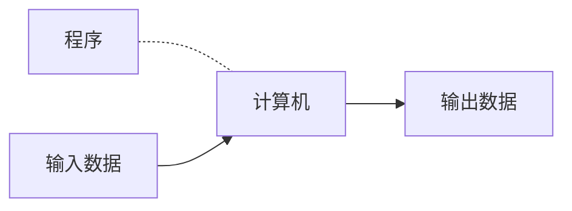
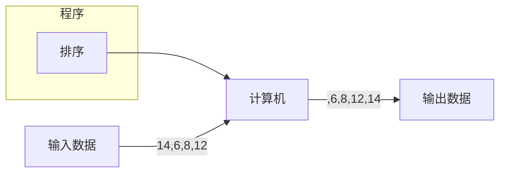
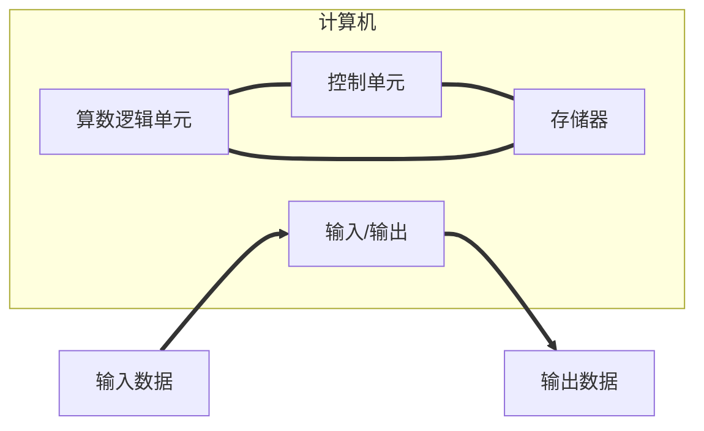
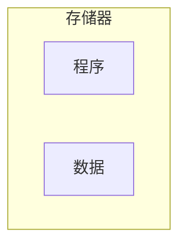
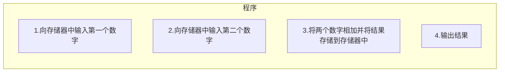

# 绪论

## 1.1 图灵模型
图灵模型：Alan Turing(阿兰·图灵)在1936年最先提出了一个通用计算设备的设想。**所有的计算都可以在一种特殊的机器上执行，这就是现在所说的图灵机。**是数学上的一种描述，不是一台真实的机器**

### 1.1.1 数据处理器


在讨论图灵模型之前，我们把计算机定义成一个**数据处理器**，依照这种定义计算机可以被看作一个接受输入数据、处理数据并产生输出数据的黑盒。

### 1.1.2 可编程数据处理器
图灵模型时一个适用于通用计算机的更好的模型。**该模型添加了一个额外的元素——程序——到不同的计算机器中。** 
**程序是用来告诉计算机如何对数据进行处理的指令集合**

基于图灵模型的计算机：可编程数据处理器
在这个图灵模型中，输出数据依赖两个方面因素的结合作用：输入数据和程序\
1.**相同的程序，不同的输入数据**\
    同样的程序输入不同的数据时，尽管程序相同，但因为处理的输入数据不同，输出也就不同


2.**相同的输入数据，不同的程序**

   ```mermaid
   graph LR;
   程序--排序-->计算机;
   输入数据--3,12,8,22-->计算机--3,8,12,22-->输出数据;
   ```
   ```mermaid
   graph LR;
   程序--相加-->计算机;
   输入数据--3,12,8,22-->计算机--45-->输出数据;
   ```
 ```mermaid
   graph LR;
   程序--寻找最小值-->计算机;
   输入数据--3,12,8,22-->计算机--3-->输出数据;
 ```
3.**相同的输入数据，相同的程序**
当输入相同的数据运行程序时，我们希望有相同的输出

### 1.1.3 通用图灵机
通用图灵机是对现代计算机的首次描述，只要提供了合适的程序，该机器就能做任何运算。

## 1.2 冯·诺依曼模型
基于通用图灵机建造的计算机都是在存储器中存储数据。在**1944~1945年**，冯·诺依曼指出，鉴于程序和数据在逻辑上是相同的，因此程序也能存储在计算机的存储器中。

### 1.2.1 4个子系统
基于冯·诺依曼模型建造的计算机分为4个子系统：**存储器、算术逻辑单元、控制单元和输入/输出**

1.存储器
存储器是用来存储的区域，在计算机的处理过程中存储器用来存储数据和程序\
2.算法逻辑单元
**算术逻辑单元(ALU)是用来进行计算和逻辑运算的地方**\
3.控制单元
控制单元是对存储器、算术逻辑单元、输入/输出等子系统进行控制操作的单元。\
4.输入/输出
输入子系统负责从计算机外部接收输入数据和程序，输出子系统负责将计算机的处理结果输出到计算机外部
输入/输出子系统的定义相当宽泛，它们还包含辅助存储设备，例如，用来存储处理所需要的程序和数据的磁盘和磁带等。

### 1.2.2 存储程序概念
**冯·诺依曼模型要求程序必须存储在存储器中**\
现代计算机的存储器用来存储程序机器相应数据。**数据和程序应该具有相同的格式，因为它们都存储在存储器中。**\
实际上它们都是以**位模式**（0和1序列）存储在存储器中的\

###  1.2.3 指令的执行顺序
**冯·诺依曼模型中的一段程序由一组数量有限的指令组成**。按照这个模型，控制单元从存储器中提取一条，解释指令、接着执行指令。指令就是一条接着一条地顺序执行。一条指令可能会请求控制单元以便跳转到其前面或者后面的指令去执行，但这并不意味指令没有按照顺序来执行。**指令的顺序执行是基于冯·诺依曼模型的计算机的初始条件**。  

## 1.3 计算机组成部分

**计算机由三大部分组成：计算机硬件、数据和计算机软件**

### 1.3.1 计算机硬件
当今的计算机硬件基于冯·诺依曼模型，且包含四部分。

### 1.3.2 数据
**冯·诺依曼模型将一台计算机定义为一台数据处理机。它接收输入数据，处理并输出相应的结果**。

#### 1.存储数据
冯·诺依曼模型并没有定义数据如何存储在计算机中。

#### 2.组织数据
尽管数据只能以一种形式（位模式）存储在计算机内部，但在计算机外部却可以表现为不同的形式。另外，计算机（以及数据处理表示法）开创了一个新兴的研究领域——**数据组织**

### 1.3.3 计算机软件
**图灵或冯·诺依曼模型的主要特征是程序的概念**。

#### 1.程序必须是存储的
在冯·诺依曼模型中，这些程序被存储在计算机的存储器中，存储器不仅要存储数据，还要存储程序。


存储器中的程序和数据

#### 2.指令的序列
这个模型还要求程序必须是有序的指令集。每一条指令操作一个或多个数据项。因此一条指令可以改变它前面指令的作用。


由指令构成的程序 

#### 3.算法

#### 4.语言
在计算机时代的早期，只有一种称为**机器语言**的计算机语言，程序员依靠写指令的方式（使用位模式）来解决问题。\
计算机科学家研究出利用符号来代表位模式，就像日常中用符号（单词）来代替一些常用的指令一样。

#### 5.软件工程
在冯·诺依曼模型中没有定义软件工程，软件工程是指**结构化程序的设计和编写**。今天，它不仅仅是用来描述完成某一任务的应用程序，还包括程序设计中所要严格遵循的原理和规则。

#### 6.操作系统
在计算机演变过程中，科学家们发现有一系列指令对所有程序来说是公用的。例如，告诉计算机在哪里接收和发送数据的指令在几乎所有的程序中都要用到。如果这些指令编写一次就可以用于所有程序，那么效率将会大大提高。这样，就出现了操作系统的概念。

## 1.4 历史
计算机的历史将其分为三个阶段：机械计算机器(1930年以前)，电子计算机的诞生(1930~1950年)，计算机的诞生(1950年至今)

### 1.4.1 机械计算机器（1930年以前）
**在这个阶段，人们发明了一些用来进行计算的机器，它们与计算机的现代概念几乎没有相似之处**。\
- **17世纪**，法国著名的数学家和物理学家布莱斯·帕斯卡（Blaise Pascal）发明了Pascaline，这是一个用来**进行加减运算的计算机器**。到了20世纪，尼克劳斯·沃思（Niklaus Wirth)发明了一种**结构化的程序设计语言，名为Pascal**。  
  
- **17世纪后期**，德国数学家戈特弗里德·莱布尼茨（Gottfried Leibnitz）发明了一台**既能够做乘除运算又能做加减运算的更加复杂的计算机器**。这台机器被称为**莱布尼茨之轮**。  

- **19世纪初期**，约瑟-玛丽·雅卡尔（Joseph-Marie Jacquard)发明了**第一台利用存储和编程概念的机器，名为雅卡尔提花织机（Jacquard loom）**。这种织机利用穿孔卡（类似于存储程序）来控制织布过程中经线的提升。  

- **1823年**，查尔斯·巴比奇（Charles Babbage）发明了一种**差分引擎**，它不仅够很容易地进行数学运算，还可以解多项式方程。后来，他发明了一种叫作**分析引擎的机器**，在某种程度上和现代计算机的概念类似。该机器由4个部分组成：制造场（现在的算术逻辑单元）、存储单元（存储器）、操作者（控制单元）和输出单元（输入/输出）。

- **1890年**，赫尔曼·何勒里斯（Herman Hollerith）设计并制造出具有**编程能力的机器**，该机器可以**自动阅读、计数和排列存储在穿孔卡上的数据**。

### 1.4.2 电子计算机的诞生（1930~1950年）
**1930~1950年，那些被视为电子计算机工业先驱的科学家们发明了一些计算机**。

#### 1.早期的电子计算机
**这一时期的早期计算机并不是将程序存储到存储器中，所有的计算机都是在外部进行编程的**。有以下五种比较杰出的计算机:  

- **1939年**，约翰·阿塔纳索夫（John V.Atanasoff）及其助手克利夫德·贝里（Clifford Berry)发明了**第一台用来完成特定任务的计算机（它是通过将信息进行电子编码来实现其功能的），它又被曾为ABC（Atanasoff Berry Computer）**,**主要用于实现解线性方程组**。  
- **在同一时期**，德国数学家康拉德·朱斯（Konrad Zuse)设计出**通用计算机，并命名为“ZI”**。  
- **20世纪30年代**，美国海军和IBM公司在哈佛大学发起了一项工程，在霍华德·艾肯（Howard Aiken）的直接领导下建造了一名名为**Mark I的巨型计算机**。这种计算机**既使用了电子部件，也使用了机械部件**。  
- 在英国，阿兰·图灵发明了一台名为**巨人（Colossus）的计算机**，这台计算机是为了破译德国Enigma密码而设计的。  
- **1946年**，约翰·莫奇勒（John Mauchly）和普雷斯波·埃克特（J. Presper Eckert)发明了**第一台通用的、完全的计算机，这台计算机被称为ENIAC（Electronic Numerical Integrator and Calculator,电子数字积分器和计算器）**。利用了将近18000个真空管，有100英尺长，10英尺高，重达30吨。

#### 2.基于冯·诺依曼模型的计算机

**前面5种计算机的存储器仅仅用来存放数据，它们利用配线或开关进行外部编程。冯·诺依曼提出的程序和数据应存储在存储器种**。按照这种方法，每次使用计算机来完成一项新任务，只需要更改程序即可。  

- **1950年，第一台基于冯氏思想的计算机在宾夕法尼亚大学诞生，名为EDVAC。同时，英国剑桥大学的莫里斯·威尔克斯（Maurice Wilkes)制造了同样类型的被称为EDSAC的计算机**。  

### 1.4.3 计算机的诞生（1950年至今）
**1950年以后出现的计算机都差不多基于冯·诺依曼模型。它们变得更快、更小、更便宜，但原理几乎是相同的。这一时期分为几代，每一代计算机的改进主要体现在硬件或软件方面（而不是模型）**。  

- 第一代计算机（大约1950~1959年）以商用计算机的出现为主要特征。计算机体积庞大，且**使用真空管作为电子开关**。  
- 第二代计算机（大约1959~1965年）**使用晶体管代替了真空管**。  
- 第三代计算机（大约1965~1975年）**集成电路（晶体管、导线以及其他部件被做在一块单芯片上）**。这个发明减少了计算机的成本和大小。**小型计算机**出现在市场上。  
- 第四代计算机（大约1975~1985年）**出现了微型计算机**。第一个桌面计算器（Altair8800)出现在1975年。电子工业的发展允许整个计算机子系统做在**单块电路板**上，这一时期还出现了**计算机网络**。
- 第五代计算机（1985年至今）**掌上计算机和台式计算机的诞生**，第二代存储媒体（CD-ROM、DVD等）的改进、多媒体的应用以及虚拟现实现象。  


