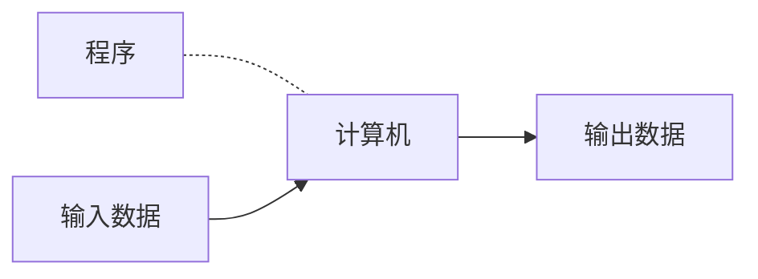
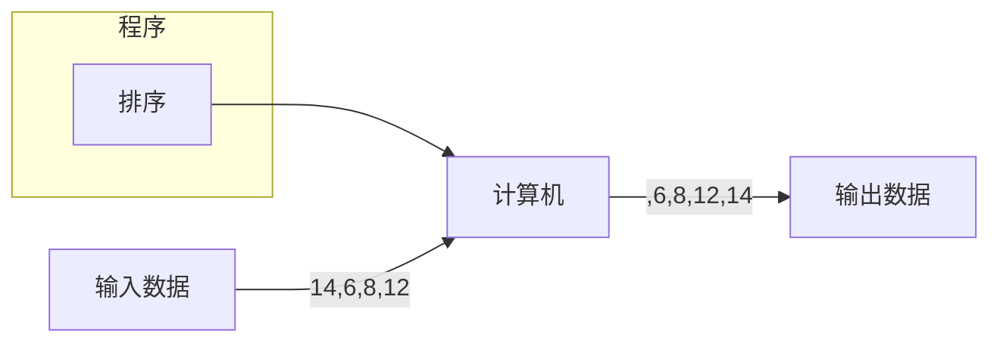
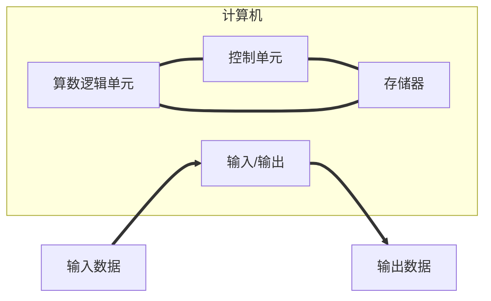
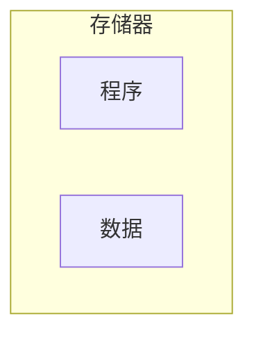
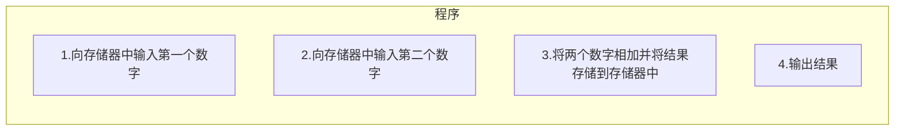

# 绪论
## 1.1 图灵模型
图灵模型：Alan Turing(阿兰·图灵)在==1936年==最先提出了一个通用计算设备的设想。**所有的计算都可以在一种特殊的机器上执行，这就是现在所说的图灵机。**

### 1.1.1 数据处理器

在讨论图灵模型之前，我们把计算机定义成一个**数据处理器**，依照这种定义计算机可以被看作一个接受输入数据、处理数据并产生输出数据的黑盒。

### 1.1.2 可编程数据处理器
图灵模型时一个适用于通用计算机的更好的模型。**该模型添加了一个额外的元素——程序——到不同的计算机器中。** 
**程序是用来告诉计算机如何对数据进行处理的指令集合****

基于图灵模型的计算机：可编程数据处理器
在这个图灵模型中，输出数据依赖两个方面因素的结合作用：输入数据和程序\
1.**相同的程序，不同的输入数据**\
    同样的程序输入不同的数据时，尽管程序相同，但因为处理的输入数据不同，输出也就不同


2.**相同的输入数据，不同的程序**

   ```mermaid
   graph LR;
   程序--排序-->计算机;
   输入数据--3,12,8,22-->计算机--3,8,12,22-->输出数据;
   ```
   ```mermaid
   graph LR;
   程序--相加-->计算机;
   输入数据--3,12,8,22-->计算机--45-->输出数据;
   ```
 ```mermaid
   graph LR;
   程序--寻找最小值-->计算机;
   输入数据--3,12,8,22-->计算机--3-->输出数据;
   ```
3.**相同的输入数据，相同的程序**
当输入相同的数据运行程序时，我们希望有相同的输出

### 1.1.3 通用图灵机
通用图灵机是对现代计算机的首次描述，只要提供了合适的程序，该机器就能做任何运算。

## 1.2 冯·诺依曼模型
基于通用图灵机建造的计算机都是在存储器中存储数据。在**1944~1945年**，冯·诺依曼指出，鉴于程序和数据在逻辑上是相同的，因此程序也能存储在计算机的存储器中。

### 1.2.1 4个子系统
基于冯·诺依曼模型建造的计算机分为4个子系统：**存储器、算术逻辑单元、控制单元和输入/输出**

1.存储器
存储器是用来存储的区域，在计算机的处理过程中存储器用来存储数据和程序\
2.算法逻辑单元
**算术逻辑单元(ALU)是用来进行计算和逻辑运算的地方**\
3.控制单元
控制单元是对存储器、算术逻辑单元、输入/输出等子系统进行控制操作的单元。\
4.输入/输出
输入子系统负责从计算机外部接收输入数据和程序，输出子系统负责将计算机的处理结果输出到计算机外部
输入/输出子系统的定义相当宽泛，它们还包含辅助存储设备，例如，用来存储处理所需要的程序和数据的磁盘和磁带等。

### 1.2.2 存储程序概念
**冯·诺依曼模型要求程序必须存储在存储器中**\
现代计算机的存储器用来存储程序机器相应数据。**数据和程序应该具有相同的格式，因为它们都存储在存储器中。**\
实际上它们都是以**位模式**（0和1序列）存储在存储器中的\

###  1.2.3 指令的执行顺序
**冯·诺依曼模型中的一段程序由一组数量有限的指令组成**。按照这个模型，控制单元从存储器中提取一条，解释指令、接着执行指令。指令就是一条接着一条地顺序执行。一条指令可能会请求控制单元以便跳转到其前面或者后面的指令去执行，但这并不意味指令没有按照顺序来执行。**指令的顺序执行是基于冯·诺依曼模型的计算机的初始条件**。  

## 1.3 计算机组成部分
**计算机由三大部分组成：计算机硬件、数据和计算机软件**

### 1.3.1 计算机硬件
当今的计算机硬件基于冯·诺依曼模型，且包含四部分。

### 1.3.2 数据
**冯·诺依曼模型将一台计算机定义为一台数据处理机。它接收输入数据，处理并输出相应的结果**。

#### 1.存储数据
冯·诺依曼模型并没有定义数据如何存储在计算机中。

#### 2.组织数据
尽管数据只能以一种形式（位模式）存储在计算机内部，但在计算机外部却可以表现为不同的形式。另外，计算机（以及数据处理表示法）开创了一个新兴的研究领域——**数据组织**

### 1.3.3 计算机软件
**图灵或冯·诺依曼模型的主要特征是程序的概念**。

#### 1.程序必须是存储的
在冯·诺依曼模型中，这些程序被存储在计算机的存储器中，存储器不仅要存储数据，还要存储程序。


存储器中的程序和数据

#### 2.指令的序列
这个模型还要求程序必须是有序的指令集。每一条指令操作一个或多个数据项。因此一条指令可以改变它前面指令的作用。


由指令构成的程序
