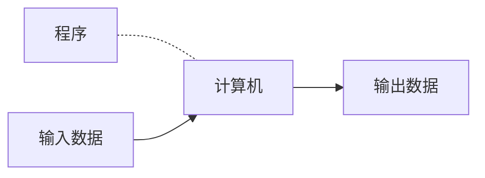
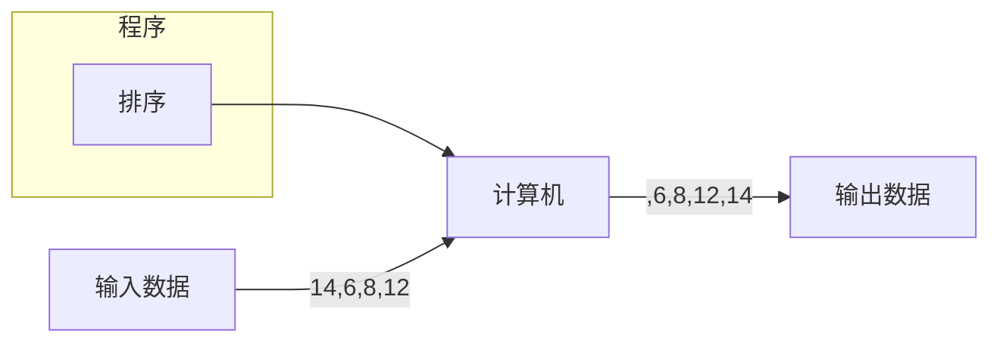

[toc]
# 绪论
## 1.1图灵模型
图灵模型：Alan Turing(阿兰·图灵)在==1936年==最先提出了一个通用计算设备的设想。==所有的计算都可以在一种特殊的机器上执行，这就是现在所说的图灵机。==
### 1.1.1数据处理器

在讨论图灵模型之前，我们把计算机定义成一个==数据处理器==，依照这种定义计算机可以被看作一个接受输入数据、处理数据并产生输出数据的黑盒。
### 1.1.2可编程数据处理器
图灵模型时一个适用于通用计算机的更好的模型。==该模型添加了一个额外的元素——程序——到不同的计算机器中。==  
==程序是用来告诉计算机如何对数据进行处理的指令集合==

基于图灵模型的计算机：可编程数据处理器
在这个图灵模型中，输出数据依赖两个方面因素的结合作用：输入数据和程序
1. **相同的程序，不同的输入数据**
    同样的程序输入不同的数据时，尽管程序相同，但因为处理的输入数据不同，输出也就不同


2. **相同的输入数据，不同的程序**

   ```mermaid
   graph LR;
   程序--排序-->计算机;
   输入数据--3,12,8,22-->计算机--3,8,12,22-->输出数据;
   ```
   ```mermaid
   graph LR;
   程序--相加-->计算机;
   输入数据--3,12,8,22-->计算机--45-->输出数据;
   ```
      ```mermaid
   graph LR;
   程序--寻找最小值-->计算机;
   输入数据--3,12,8,22-->计算机--3-->输出数据;
   ```
3. **相同的输入数据，相同的程序**
当输入相同的数据运行程序时，我们希望有相同的输出
### 1.1.3通用图灵机
通用图灵机是对现代计算机的首次描述，只要提供了合适的程序，该机器就能做任何运算。
## 1.2冯·诺依曼模型